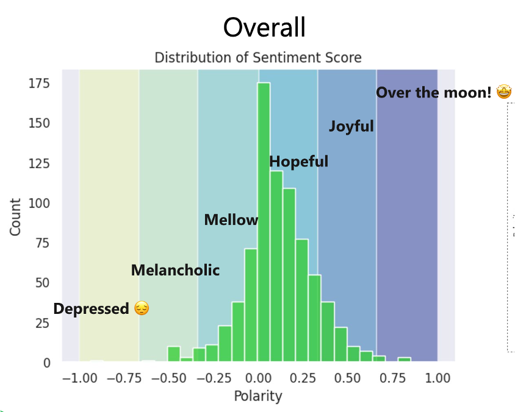

# Mood-Match PlayList Generator 

## About 🚀

This is a very interesting project that we worked as a part of [Master of Management Analytics]() at [McGill University]() with an excellent group.

The problem behind this idea is that, currently there is not any solution that recommend songs based on our mood. Let me clarify this. Music streaming platforms probably know how we are feeling based on our interactions but, what about if we say the platform how are we feeling in that moment. For example, after a bad breakup, we can simply write "I'm very sad and I just want to listen songs about breakups", and then, we receive recommendation based on this input.

With this in mind, we proposed a very interesting approach that combines sentiment analysis, natural language processing techniques, machine learning and recommendation algorithms. This article describes the end-to-end process of development of this solution, from the data extract process to the recommendation output.

## Data extraction process

This project did not use an existing dataset. Instead, we have created our own dataset using two main sources of data. First, we used [Spotify API]() to extract info about songs and audio features. Documentation about audio features is extensive and the data available includes name of the songs, authors, popularity, among other variables. For this part, we extract songs from three languages: Spanish, English and French.

Since we wanted to apply Natural Language Processing, we also wanted to use lyrics of the songs. This was particularly difficult since data of this type is hard to find and to extract, but using [LyricsGenius API]() this task became easier. 

After that, we were able to extract data from the favorite playlist of each member of the group and we collected data from about 1000 songs. Of course, this data still needed to be cleaned, since some songs did not have lyrics, or some of them were in another language except the three we chose to perform our analysis. Additionally, we need to create the independent variable to train our machine learning algorithm to predict sentiment.

Another challenging part was the feature preprocessing to handle text. On the following section, we will explain waht we have done regarding this matter, the tecniques and the libraries used.

## Data preprocessing

As we mentioned before, yhis was one of the most difficult part. As a first step, we decided to delete all the records that were not on the languages we were working on (Spanish, English, French), then, we deleted all the records without lyrics, and finally, we deleted duplicted records.

After this first step, we had to label our data based on the sentiment expressed in the lyrics. This would be the target of our machine learning model. To do this, we had two options: first, to label each record manually after reading the lyrics of each song. Second, we can use a sentiment analyzer (such as HuggingFace, NLTK or Transformers). We decided to use the second the second approach since it was less time-consuming and equally accurate. We have tried the three options described above, but we decided to use HuggingFace since it gave us a more normally distributed results (the polarity scores of this library go from -1 to 1, being -1 the most negative sentiment and 1 the most positive sentiment). To construct the target variable, we transformed the polarity score into six categories (Depressed, Melancholic, Mellow, Hopeful, Joyful, Over the moon!). This would become our target variable to our machine learning model.

| Lower Bound | Upper Bound | Label          |
|-------------|-------------|----------------|
| -1.0        | -0.67       | depressed      |
| -0.67       | -0.34       | melancholic    |
| -0.34       | 0.0         | mellow         |
| 0.0         | 0.33        | hopeful        |
| 0.33        | 0.66        | joyful         |
| 0.66        | 1.0         | over the moon  |

Besides defining the target variable, we had to handle with the, according to me, the most difficult part (and the funniest), which was handling the lyrics data (handling text, in other words). To do this, we mainly used ``NLTK`` library, `SKLearn` and ``langdetect``. First, we tokenize the lyrics (converting each word into a token), then, using `NLTK`, we removed stop words (those words that are meaningless to the analysis) for each language. Once done this, we applied lemmatization, to keep only the roots of each word. Finally, using `SKLearn`, we vectorized the words using `TfidfVectorizer`. To capture accuractely the sense of the lyrics, we limited the process up to trigrams. With these outputs, our dataset was ready to be trained by a machine learning model.

On the next section, we will talk about the modeling part

## Modeling

The modeling part was divided in three parts: First, we trained a model to predict the sentiment (classification model). Second, we trained a clusterization model using audio features variables to identify which songs sound similar. Finally, based on the outputs of these two models, we created a recommendation algorithm that match user's inputs and predictions of the previous models. On the following section it is described at more detailed how it works each algorithm.

### Classification model

For this part, our goal was to predict the sentiment of a song. Since on the preprocessing part we have created the target variable with six categories (Depressed, Melancholic, Mellow, Hopeful, Joyful, Over the moon!), we trained different algorithms looking for a better performance. The independent variables used include lyrics (after preprocessing), audio features, year of release, among other. On the following table you can see the algorithms used and the performance of each one: 

| Algorithm       | Accuracy Score |
|-----------------|----------------|
| CatBoost        | 0.7121         |
| LightGBM        | 0.7121         |
| XGBoost         | 0.6919         |
| Random Forest   | 0.7071         |
| Multilayer Perceptron           | 0.6616         |
| Stacked Model   | 0.7010         |

For those algorithms that do not accept categorical variables by default (all except LigthGBM, CatBoost, XGBoost), we used binary encoding and one hot encoding.

### Clustering model

For this model, we used only audio feature variables `'liveness','acousticness','energy','instrumentalness','loudness','speechiness','tempo','duration','danceability'` and we trained a KMeans algorithm with `K=6`. The selection of the cluster was made considering Elbow method. 

As a preprocessing step for this algorithm, we standardize the variables to have a mean of 0 and a standard deviation of 1.

### Recommendation algorithm

For performing the recommendation, we followed many steps: first, we preprocessed the user's input following our data preprocessing pipeline. Then, using `HuggingFace` we calculated the polarity score and, based on that, we defined the user input sentiment. After that, from all our dataset of songs, we predicted the sentiment using our machine learning model. Then, we filtered all the songs that has the same predicted sentiment. 

Only using the filtered songs, we calculated the cosine similarity based on the user input and the lyrics of the songs. Then, we identified the most similar, and based on that song, we filtered the most similar songs that belongs to the same cluster of the most similar song identified previously. That is the output of the recommendation.

## Code and Repo

Probably all the text is confusing, so you can find all the project on the following repository 

## Let's talk

